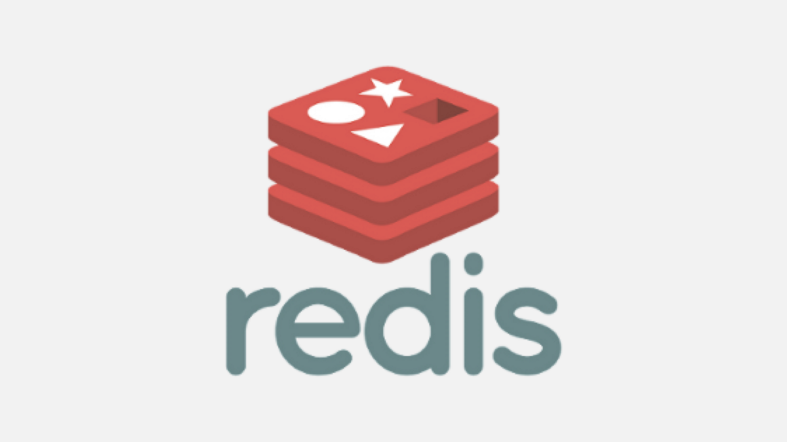

### redis-publisher-subscriber
#### Redis ile üretici(pub(publisher)) ve tüketici(sub(subscriber(abone olucu))).

#### Redis, bir veri yapısı sunucusudur. Açık kaynak, bellek kullanımlı, anahtar-değer deposudur. Redis "Uzak Sözlük Sunucusu" anlamına gelmektedir. Çeşitli kaynaklara göre en çok kullanılan anahtar-değer veritabanıdır. Haziran 2015'ten beri Redis Labs şirketi tarafından geliştirilmesine destek sağlanmaktadır.

#### Eclipse ile projeyi içe aktarmanın yolu: File > Import > Maven > Existing Maven Project Browse > Select Directory.
